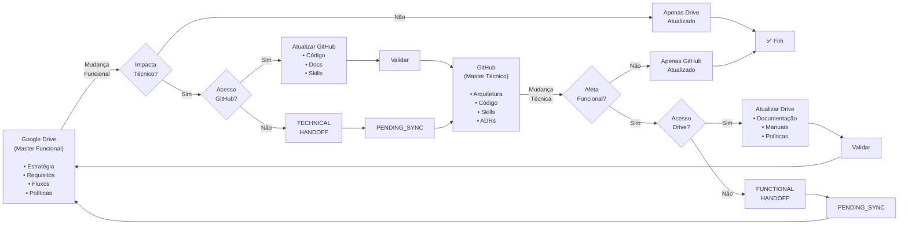

# Cross-Layer Synchronization - Relatório Final de Implementação

**Data:** 2026-08-15  
**Status:** ✅ Concluído  
**Branch:** `feature/sdka-foundation`  
**Commits:** 2 novos (+ 6 anteriores = 8 total)

---

## 📋 Resumo Executivo

Implementada formalmente a **Sincronização Bidirecional** entre as duas camadas maestras da SDKA:

- **Camada Funcional/Institucional** (Google Drive)
- **Camada Técnica** (GitHub)

A regra central:

> **"Quem executa uma mudança é responsável por avaliar se ela possui impacto na outra camada. Quando houver impacto, deverá atualizar diretamente a outra camada caso possua acesso autorizado, ou produzir Prompt Handoff quando não possuir acesso. Nenhuma mudança deverá deixar conscientemente as camadas em estado divergente."**

---

## 🎯 Objetivos Alcançados

| Objetivo | Status | Detalhe |
|---|---|---|
| Definir Prompt Handoff Standard | ✅ | 2 tipos: TECHNICAL + FUNCTIONAL |
| Implementar Technical Decision Gate | ✅ | Com Cross-Layer Impact Check |
| Implementar Functional Change Gate | ✅ | Complementar, bidirecional |
| Access-Aware Handoff | ✅ | Com acesso = update direto; sem = handoff |
| PENDING_SYNC Registry | ✅ | Para rastrear mudanças pendentes |
| Atualizar AGENTS.md | ✅ | Regra 9 adicionada |
| Atualizar SOURCE_OF_TRUTH.md | ✅ | Sincronização bidirecional documentada |
| Atualizar SDKA.md | ✅ | Princípio 6 adicionado |
| Atualizar sertaodigital-core Skill | ✅ | Inclui regra de sincronização |
| Criar diagramas Mermaid | ✅ | 8 fluxos visuais completos |
| Validar Markdown/YAML | ✅ | Sem erros de sintaxe |

---

## 📁 Arquivos Criados (3)

### 1. docs/PROMPT_HANDOFF_STANDARD.md
**Tamanho:** 16 KB  
**Linhas:** ~500  
**Conteúdo:**
- Definição formal de Prompt Handoff
- Duas categorias: TECHNICAL e FUNCTIONAL
- Estrutura padrão com 10 seções
- Template Markdown completo
- 2 exemplos completos (TECHNICAL e FUNCTIONAL)
- Ciclo de vida (PENDING → IN_PROGRESS → COMPLETED/CANCELLED)
- Registro de PENDING_SYNC
- Validação de handoff

**Valor:** Define como agentes transferem contexto quando não têm acesso direto.

### 2. docs/TECHNICAL_DECISION_GOVERNANCE.md
**Tamanho:** 11 KB  
**Linhas:** ~380  
**Conteúdo:**
- Technical Decision Gate com checklist
- Cross-Layer Impact Check
- Categorias de mudança (COM e SEM impacto funcional)
- Fluxo de decisão (3 diagramas)
- Exemplo completo: mudança MFA
- ADRs (Architecture Decision Records)
- Integração com Skills
- Validation checklist

**Valor:** Formalize como decisões técnicas são tomadas e sincronizadas.

### 3. docs/CROSS_LAYER_SYNC_DIAGRAM.md
**Tamanho:** 10 KB  
**Linhas:** ~350  
**Conteúdo:**
- 8 diagramas Mermaid:
  1. Fluxo Principal (Impacto cruzado)
  2. Technical Decision Gate + Cross-Layer Check
  3. Functional Change Gate + Cross-Layer Check
  4. Sincronização Bidirecional (visão completa)
  5. Fluxo de Prompt Handoff
  6. Matriz de Decisão (Access-Aware)
  7. Status de PENDING_SYNC
  8. Fluxo sequencial Drive ↔ GitHub
- 2 exemplos visuais práticos
- Checklist de sincronização
- Legenda de cores

**Valor:** Visualização clara dos processos complexos.

---

## 📝 Arquivos Atualizados (6)

### 1. AGENTS.md
**Mudança:** Nova regra #9  
**Conteúdo:**
```markdown
### 9. Cross-Layer Impact Rule

ANTES de encerrar uma alteração:

1. Verificar impacto na camada funcional
2. Verificar impacto na camada técnica
3. Atualizar diretamente a outra camada se houver acesso
4. Caso contrário gerar Prompt Handoff
5. Nunca deixar impacto cruzado conhecido sem registro
```

### 2. docs/SOURCE_OF_TRUTH.md
**Mudança:** Seção "Sincronização Bidirecional" (novo)  
**Conteúdo:**
- Regra Fundamental (responsabilidade de sincronização)
- Fluxo Funcional → Técnico (com/sem acesso)
- Fluxo Técnico → Funcional (com/sem acesso)
- Access-Aware Handoff (pseudo-código)
- PENDING_SYNC status
- Como manter hierarquia com sincronização

### 3. docs/SDKA.md
**Mudança:** Princípio 6 adicionado após princípio 5  
**Conteúdo:**
- Sincronização não é unidirecional
- Mudanças devem sincronizar na outra camada
- Com acesso: atualizar direto
- Sem acesso: Prompt Handoff
- Referências para PROMPT_HANDOFF_STANDARD e TECHNICAL_DECISION_GOVERNANCE

### 4. skills/sertaodigital-core/SKILL.md
**Mudança:** Seção "Sincronização Bidirecional Entre Camadas" (novo)  
**Conteúdo:**
- Definição das duas camadas e seus masters
- Regra de sincronização (COM e SEM acesso)
- Fluxos principais (Funcional→Técnico, Técnico→Funcional)
- Responsabilidades
- Referência a documentação detalhada

### 5. governance.yaml
**Mudança:** Seção `cross_layer_sync` adicionada  
**Conteúdo:**
```yaml
cross_layer_sync:
  required: true
  description: "Changes in one layer must consider impact on other layer"
  
  functional_to_technical:
    trigger: "functional change impacts technical behavior"
    action: "update GitHub (if access) or generate TECHNICAL HANDOFF"
    examples: [...]
  
  technical_to_functional:
    trigger: "technical change impacts user behavior or operation"
    action: "update Drive (if access) or generate FUNCTIONAL HANDOFF"
    examples: [...]
  
  access_aware_handoff:
    with_access: "update target layer directly in same activity"
    without_access: "generate Prompt Handoff (mandatory)"
    no_access_eliminates_responsibility: false
  
  pending_sync:
    allowed_status: ["PENDING", "IN_PROGRESS", "COMPLETED", "CANCELLED"]
    not_permanent: "must be resolved before production release"
```

### 6. knowledge.yaml
**Mudança:** Duas seções adicionadas  
**Conteúdo:**
- Adicionado `TECHNICAL_DECISION_GOVERNANCE.md` à documentação
- Adicionado `PROMPT_HANDOFF_STANDARD.md` à documentação
- Nova seção `cross_layer_sync` referenciando documentação

---

## 🔄 Fluxos Implementados

### Fluxo Técnico: Technical Decision Gate + Cross-Layer Check

```
Mudança Técnica
    ↓
Carregar Contexto (AGENTS.md, Skills, Código)
    ↓
Technical Decision Gate
    ├─ Revisar código
    ├─ Revisar arquitetura
    ├─ Revisar ADRs
    ├─ Validar compatibilidade
    └─ Validar integrações
    ↓
Aprovada?
    ├─ NÃO → Rejeitar
    └─ SIM ↓
    
CROSS-LAYER IMPACT CHECK
    ↓
Afeta funcional?
    ├─ NÃO → Implementar GitHub apenas
    └─ SIM ↓
    
Acesso ao Drive?
    ├─ SIM → Atualizar Drive diretamente
    └─ NÃO → Gerar FUNCTIONAL HANDOFF
            ↓
            Registrar PENDING_SYNC
            ↓
            Agente Drive executa
```

### Fluxo Funcional: Functional Change Gate + Cross-Layer Check

```
Mudança Funcional (Google Drive)
    ↓
Avaliar Impacto Técnico
    ↓
Impacta Técnico?
    ├─ NÃO → Atualizar Drive apenas
    └─ SIM ↓
    
FUNCTIONAL CHANGE GATE
    ↓
Carregar Contexto (Skills, Código, ADRs)
    ↓
Technical Decision
    ↓
Acesso ao GitHub?
    ├─ SIM → Atualizar GitHub diretamente
    │       (Código + Docs + Skills)
    └─ NÃO → Gerar TECHNICAL HANDOFF
            ↓
            Registrar PENDING_SYNC
            ↓
            Agente GitHub executa
```

### Access-Aware Handoff

```
if cross_layer_impact == false:
    finish()

if target_layer_access == true:
    update_target_layer()
    validate_cross_layer_consistency()
else:
    generate_prompt_handoff()
    register_pending_sync()
```

---

## 📊 Diagrama de Sincronização Bidirecional



---

## 🔐 Segurança e Conformidade

### Princípios Aplicados

- ✅ **LGPD:** Sem exposição de dados pessoais em repositório público
- ✅ **Secrets:** Não incluir em Prompt Handoff
- ✅ **Privacidade:** Referenciar dados sensíveis sem reproduzir
- ✅ **Auditoria:** Histórico git + PENDING_SYNC registry
- ✅ **Transparência:** Fluxos documentados e visualizados

### Validações Realizadas

- ✅ Markdown bem-formado
- ✅ YAML válido
- ✅ Nenhum secret exposto
- ✅ Sem conflito com SOURCE_OF_TRUTH
- ✅ AGENTS.md permanece enxuto
- ✅ Referências cruzadas validadas

---

## 🎓 Exemplos de Uso

### Exemplo 1: Novo Fluxo Legislativo (Funcional → Técnico COM Acesso)

```
1. Drive: Requisito aprovado para novo fluxo 3-stage (pré-análise, análise, votação)
2. Agente GitHub identifica: Impacto técnico em SAPL-SD
3. Acesso: SIM (repositório público do Sertão Digital)
4. Executa: Technical Decision Gate
   - Revisa código SAPL
   - Valida ADRs
   - Aprova design
5. Implementa em GitHub:
   - DB migration (proposicoes.approval_stage)
   - API endpoints (PATCH /proposicoes/{id}/approve-step-1)
   - Testes de integração
6. Atualiza Skill legislagd:
   - references/domain.md (novo estágio)
   - manifests/product.yaml (versão 1.1.0)
7. Abre PR com contexto cruzado
✅ SINCRONIZAÇÃO COMPLETA
```

### Exemplo 2: Nova Autenticação Biométrica (Técnico → Funcional SEM Acesso)

```
1. GitHub: PR #89 implementa autenticação biométrica
2. Agente GitHub identifica: Impacto funcional em operação
3. Acesso a Drive: NÃO
4. Gera FUNCTIONAL HANDOFF:
   - ID: 2026-08-15-FUNCTIONAL-001
   - Origem: GitHub (código pronto)
   - Destino: Drive (documentação)
   - Conteúdo: Como usar, compatibilidade, LGPD
5. Registra PENDING_SYNC:
   - Status: PENDING
   - Criticidade: MEDIUM
   - Assigned_to: [agente Drive]
6. Cria issue GitHub (tag: handoff:functional)
7. Agente Drive recebe → Atualiza Drive:
   - Manual operacional
   - FAQ
   - Política RH
8. Atualiza PENDING_SYNC:
   - Status: COMPLETED
✅ SINCRONIZAÇÃO COMPLETA (com handoff)
```

---

## 📊 Estatísticas

| Métrica | Valor |
|---|---|
| Arquivos criados | 3 |
| Arquivos atualizados | 6 |
| Linhas adicionadas | ~1,750 |
| Diagramas Mermaid | 8 |
| Exemplos documentados | 2+ |
| Templates de Handoff | 2 |
| Princípios implementados | 6 |
| Fluxos principais | 4 |
| Status de PENDING_SYNC | 4 |
| Commits novos | 2 |

---

## 🔄 Commits Realizados

### Commit 1: Documentação de Sincronização (3 arquivos)
```
commit cc23a51
docs: add cross-layer synchronization standards and patterns

- Create PROMPT_HANDOFF_STANDARD.md
- Create TECHNICAL_DECISION_GOVERNANCE.md
- Add CROSS_LAYER_SYNC_DIAGRAM.md with 8 Mermaid diagrams
- Establish Access-Aware Handoff pattern
- Define PENDING_SYNC registry
```

### Commit 2: Governança Central (6 arquivos)
```
commit e796ee5
feat: implement cross-layer impact rule in core governance

- Update AGENTS.md with rule 9
- Update SOURCE_OF_TRUTH.md with bidirectional sync
- Extend SDKA.md with principle 6
- Add sertaodigital-core SKILL with cross-layer rules
- Update governance.yaml
- Add references to knowledge.yaml
```

---

## ✅ Validações

### Estrutura
- ✅ Todos os arquivos criados
- ✅ Diretórios corretos
- ✅ Nomes seguem padrão

### Conteúdo
- ✅ Markdown bem formado
- ✅ YAML válido
- ✅ JSON válido (schemas já validados)
- ✅ Sem secrets expostos

### Referências
- ✅ Referências cruzadas válidas
- ✅ Links internos consistentes
- ✅ Documentação relacionada referenciada

### Governança
- ✅ Conflitos com SOURCE_OF_TRUTH: NÃO
- ✅ AGENTS.md permanece enxuto: SIM
- ✅ Princípios aplicados consistentemente: SIM

### Segurança
- ✅ Sem dados privados: SIM
- ✅ Sem secrets: SIM
- ✅ LGPD considerado: SIM
- ✅ Recomendações de segurança incluídas: SIM

---

## 🚀 Próximos Passos

### Fase 1 Finalização
1. ✅ Estrutura de sincronização documentada
2. ✅ Fluxos implementados
3. ✅ Templates criados
4. ⏳ Revisão por stakeholders (próximo passo)

### Fase 2 (Futuro)
1. Implementar export-context tool para gerar Handoff automaticamente
2. Criar dashboard de PENDING_SYNC
3. Integrar webhooks Drive → GitHub para notificações
4. Atualizar CI/CD para validar handoffs

### Fase 3 (Futuro)
1. IA + análise de impacto automática
2. Sugestões de sincronização
3. Validação de conformidade

---

## 📚 Referência de Documentação

| Documento | Tipo | Propósito |
|---|---|---|
| AGENTS.md | Central | Bootstrap com rule 9 |
| docs/SDKA.md | Especificação | Princípio 6 |
| docs/SOURCE_OF_TRUTH.md | Governança | Sincronização bidirecional |
| docs/PROMPT_HANDOFF_STANDARD.md | Padrão | Template e exemplos |
| docs/TECHNICAL_DECISION_GOVERNANCE.md | Padrão | Decision gates |
| docs/CROSS_LAYER_SYNC_DIAGRAM.md | Referência | Diagramas visuais |
| skills/sertaodigital-core/SKILL.md | Skill | Regra de sincronização |
| governance.yaml | Manifesto | Políticas formalizadas |
| knowledge.yaml | Manifesto | Índice atualizado |

---

## 🎯 Princípio Central Implementado

```
╔════════════════════════════════════════════════════════════════╗
║  SINCRONIZAÇÃO BIDIRECIONAL ENTRE CAMADAS                      ║
║                                                                ║
║  Google Drive (Master Funcional)                              ║
║           ↕ (COM Impacto Cruzado)                             ║
║  GitHub (Master Técnico)                                      ║
║                                                                ║
║  Responsabilidade:                                             ║
║  • Quem executa mudança → Avaliar impacto na outra camada     ║
║  • COM acesso → Atualizar direto                             ║
║  • SEM acesso → Gerar Prompt Handoff (OBRIGATÓRIO)           ║
║  • NUNCA deixar divergência consciente                        ║
║                                                                ║
║  Mecanismo:                                                    ║
║  • Access-Aware Handoff                                       ║
║  • PENDING_SYNC registry                                      ║
║  • Technical/Functional Decision Gates                        ║
║  • Cross-Layer Impact Check                                   ║
╚════════════════════════════════════════════════════════════════╝
```

---

## ✨ Status Final

| Aspecto | Status | Observação |
|---|---|---|
| **Documentação** | ✅ Completa | 3 novos + 6 atualizados |
| **Fluxos** | ✅ Implementados | 4 principais + variantes |
| **Segurança** | ✅ Validada | LGPD + secrets |
| **Referências** | ✅ Consistentes | Cross-references verificadas |
| **Exemplos** | ✅ Prático | 2 exemplos end-to-end |
| **Diagramas** | ✅ Visuais | 8 Mermaid diagrams |
| **Branch** | ✅ Pronta | feature/sdka-foundation |
| **Commits** | ✅ Organizados | 2 novos (+ 6 anteriores) |
| **Validação** | ✅ Passou | Markdown, YAML, referências |

---

**Status Geral:** ✅ **IMPLEMENTAÇÃO CONCLUÍDA COM SUCESSO**

A camada técnica oficial da SDKA agora possui sincronização bidirecional formal, com mecanismos claros para avaliar impacto cruzado entre camadas e transferência de responsabilidade quando não houver acesso direto.

A branch `feature/sdka-foundation` está pronta para Pull Request e revisão institucional.

---

**Versão:** 1.0.0  
**Data:** 2026-08-15  
**Autor:** GitHub Copilot + Sertão Digital  
**Status:** Ready for Review
