# Cross-Layer Synchronization Flows

Diagramas visuais dos fluxos de sincronização bidirecional entre camadas funcional e técnica.

---

## Fluxo Principal: Decisão com Impacto Cruzado

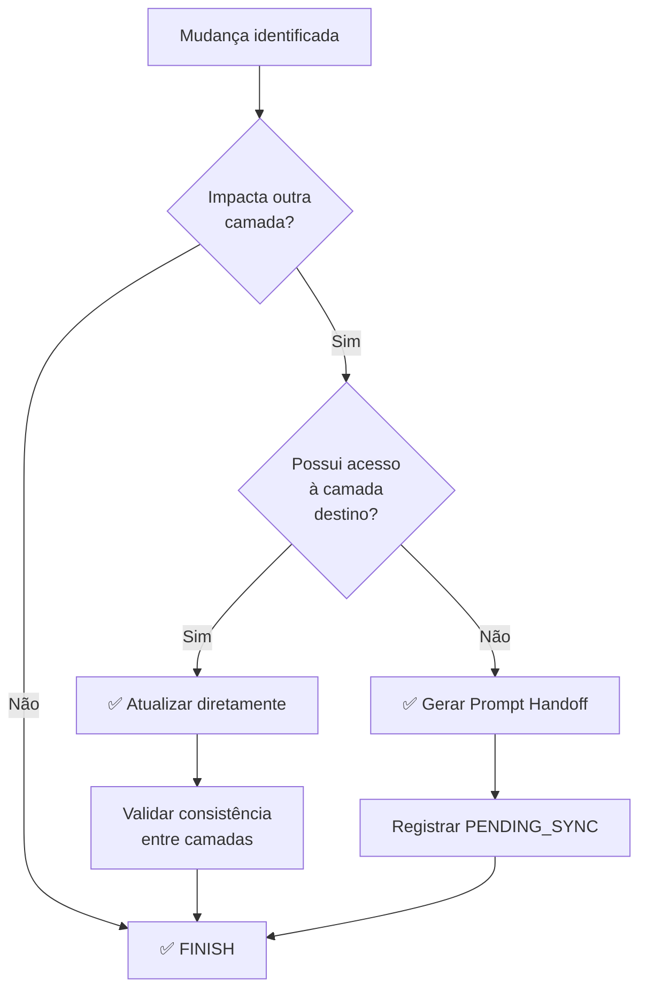

---

## Fluxo Técnico: Technical Decision Gate + Cross-Layer Check

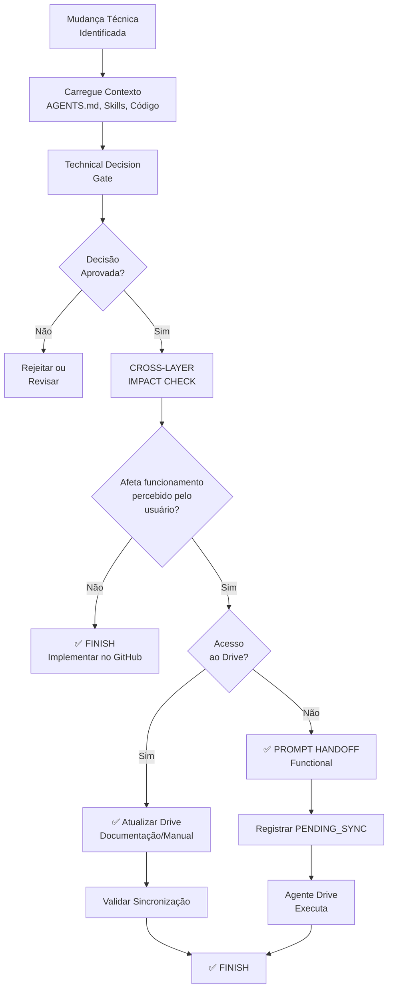

---

## Fluxo Funcional: Functional Change Gate + Cross-Layer Check

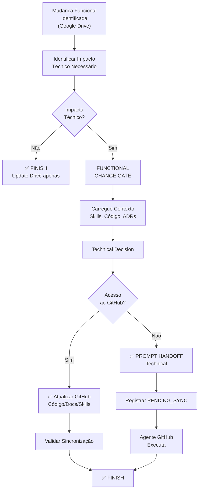

---

## Sincronização Bidirecional: Visão Completa

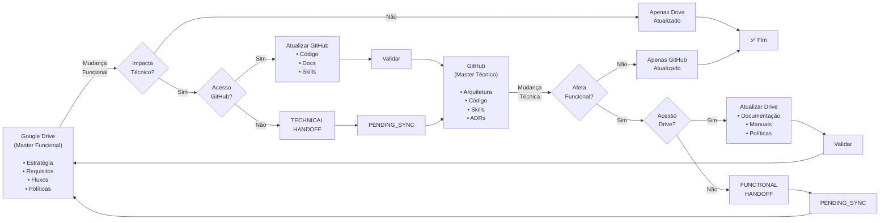

---

## Fluxo de Prompt Handoff

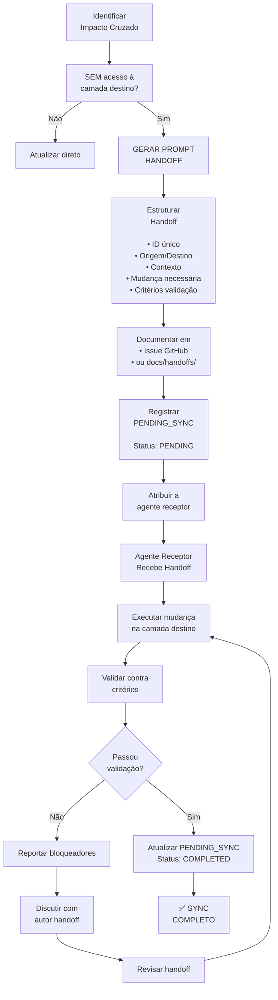

---

## Matriz de Decisão: Access-Aware Handoff

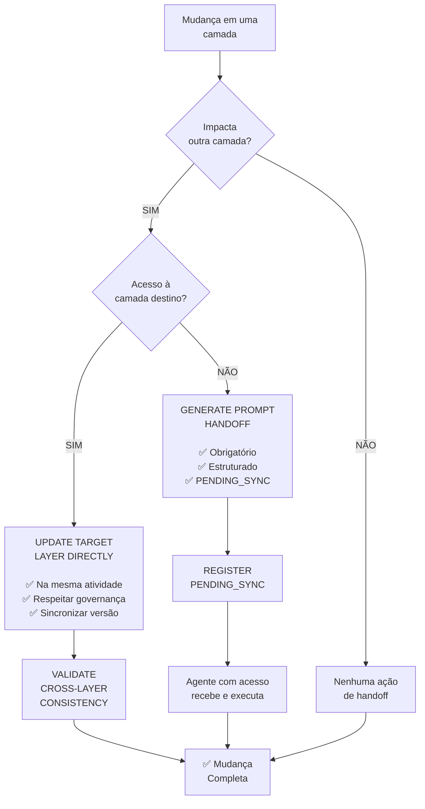

---

## Status de PENDING_SYNC

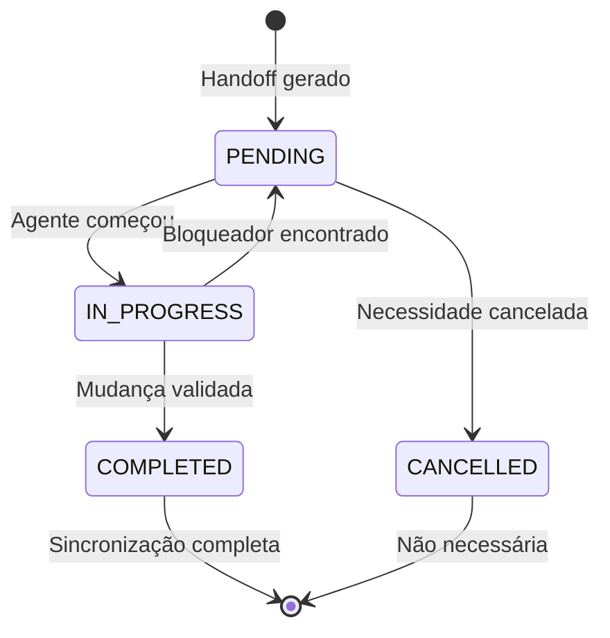

---

## Fluxo de Sincronização Drive ↔ GitHub

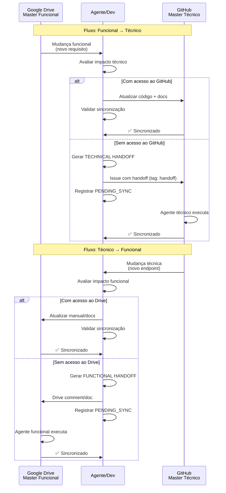

---

## Checklist de Sincronização

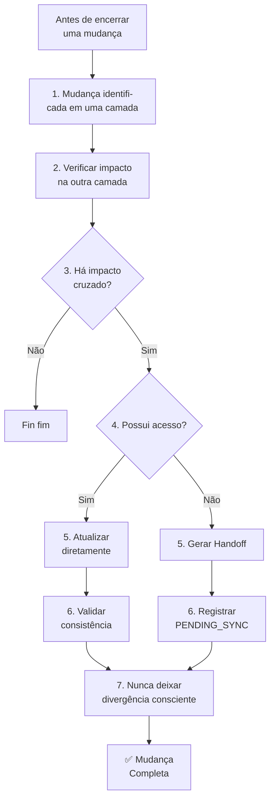

---

## Exemplos Visuais

### Exemplo 1: Novo Fluxo Legislativo (Funcional → Técnico com Acesso)

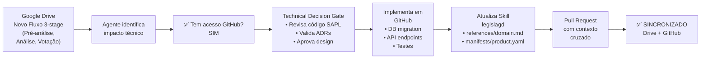

### Exemplo 2: Nova Autenticação Biométrica (Técnico → Funcional sem Acesso)

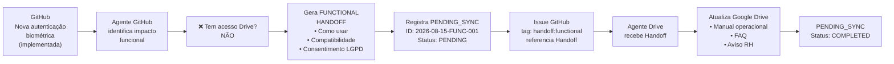

---

## Legenda de Cores (Mermaid)

- 🟢 **Verde:** Ação executada, sucesso
- 🟠 **Laranja:** Decisão, ponto de escolha
- 🔴 **Vermelho:** Bloqueador, rejeição
- 🟡 **Amarelo:** Aguardando ação externa
- 🔵 **Azul:** Informação, referência

---

**Versão:** 1.0.0  
**Última atualização:** 2026-08-15
